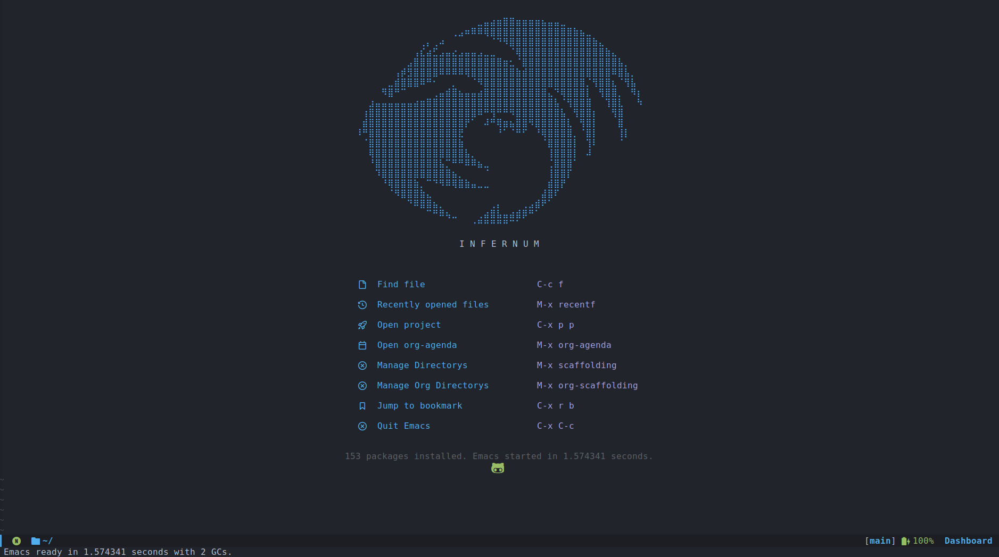

# Emacs Dotfiles
This is my personal Emacs Dotfiles. I use 
`straight.el` and `use-package`



## Content
```
Files:
init.el - Loads configs from lisp dir
early-init.el - Optimization for emacs

Directorys:
lisp - the main directory for emacs
```

## Installation
before installing dotfiles, do a bakcup
```bash
git clone https://github.com/Ianiksdf/Emacs-Dotfiles.git ~/.config/emacs

## Costume functions (Scaffolding)
Scaffoloding is just isolated consult dir which behaves like a project manager for default directorys
